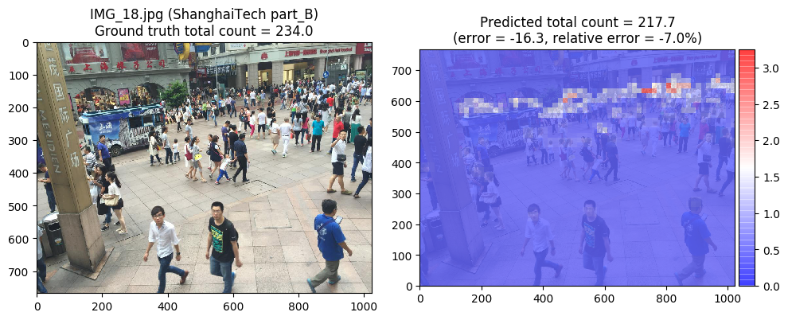

# S-DCNet and SS-DCNet
This is an unofficial implementation (Pytorch) of S-DCNet and SS-DCNet.

The papers are
* ["From Open Set to Closed Set: Counting Objects by Spatial Divide-and-Conquer"](https://arxiv.org/abs/1908.06473) ([official repo](https://github.com/xhp-hust-2018-2011/S-DCNet))
* ["From Open Set to Closed Set: Supervised Spatial Divide-and-Conquer for Object Counting"](https://arxiv.org/abs/2001.01886) ([official repo](https://github.com/xhp-hust-2018-2011/SS-DCNet))

See the exact references at the bottom of this page.

Discussions indicate that the authors do not have plans to release the training code (as of Oct 2019). 

This repository contains the code for model training and evaluation on the published datasets ShanghaiTech Part_A and Part_B. Code for inference on standalone user-provided images is also present. Only classification-based counter (C-Counter) is implemented (regression-based counter (R-Counter) is not).


## Environment
Install required packages according to `requirements.txt`.

All of the scripts intended to be run by user (`gen_density_maps.py`, `train.py`, `evaluate.py`, `inference.py`) are powered by [Hydra](https://hydra.cc/) configuration system. Run any script with `--help` to see the available options. The configuration files are in [conf/](conf/) directory.


## Datasets
Download the ShanghaiTech dataset using the links from [this repo](https://github.com/desenzhou/ShanghaiTechDataset) or from [kaggle](https://www.kaggle.com/tthien/shanghaitech). After unpacking the archive, you will have the following directory structure:

```
./
└── ShanghaiTech/
    ├── part_A/
    │   ├── test_data/
    │   │   ├── ground-truth/GT_IMG_{1,2,3,...,182}.mat
    │   │   └── images/IMG_{1,2,3,...,182}.jpg
    │   └── train_data/
    │       ├── ground-truth/GT_IMG_{1,2,3,...,300}.mat
    │       └── images/IMG_{1,2,3,...,300}.jpg
    └── part_B/
        ├── test_data/
        │   ├── ground-truth/GT_IMG_{1,2,3,...,316}.mat
        │   └── images/IMG_{1,2,3,...,316}.jpg
        └── train_data/
            ├── ground-truth/GT_IMG_{1,2,3,...,400}.mat
            └── images/IMG_{1,2,3,...,400}.jpg
```


## Ground truth density maps
Generate ground truth density maps by running a command like 

```Shell
python gen_density_maps.py dataset=ShanghaiTech_part_B
# and/or similarly for part_A
```

Files with the names `density_maps_part_{A|B}_{train,test}.npz` will appear in the current directory.

The generated density maps can be visualized and compared to the pre-calculated density maps provided by the [official repo](https://github.com/xhp-hust-2018-2011/S-DCNet) (only for the test sets of ShanghaiTech Part_A and Part_B). In order to do so, download the archive `Test_Data.zip` using the links in the `Data` section of the README in the official repo. After unpacking the archive, you will have the following directory structure:

```
./
└── Test_Data/
    ├── SH_partA_Density_map/
    │   ├── test/
    │   │   ├── gtdens/IMG_{1,2,3,...,182}.mat
    │   │   └── images/IMG_{1,2,3,...,182}.jpg
    │   └── rgbstate.mat
    └── SH_partB_Density_map/
        ├── test/
        │   ├── gtdens/IMG_{1,2,3,...,316}.mat
        │   └── images/IMG_{1,2,3,...,316}.jpg
        └── rgbstate.mat
```

Next, run `gen_density_maps.py` with the path to the `gtdens` directory:

```Shell
python gen_density_maps.py \
    dataset=ShanghaiTech_part_B \
    dataset.xhp_gt_dmaps_dir=./Test_Data/SH_partB_Density_map/test/gtdens \
# and/or similarly for part_A
```

Directory named `cmp_dmaps_part_{A|B}_test_<some_random_string>` containing pairs of images (named `IMG_<N>_my.png` / `IMG_<N>_xhp.png`) will be created.


## Training
`train.py` is the script for training a model. Launch the script by a command like this:

```Shell
python train.py dataset=ShanghaiTech_part_B
# and/or similarly for part_A
```

Fine-tuning is supported (check the option `train.pretrained_ckpt`).

The logs and checkpoints generated during training are placed to a folder named like `outputs/<launch_date>/<launch_time>`. Plots of MAE and MSE vs epoch number can be visualized by `tensorboard`:

```Shell
tensorboard --logdir outputs/<date>/<time>
```


## Evaluation
`evaluate.py` is the script for evaluating a checkpoint. Select a checkpoint for epoch `N` and run a command like this:

```Shell
python evaluate.py \
    dataset=ShanghaiTech_part_B\
    test.trained_ckpt_for_inference=outputs/<date>/<time>/checkpoints/epoch_<N>.pth
```

You will get an output like this for part_A:

```
Evaluating on the (whole) train data and on the test data (in ./ShanghaiTech/part_A)
Metrics on the (whole) train data: MAE: 5.67, MSE: 23.08
Metrics on the test data:          MAE: 60.96, MSE: 104.73
```

or like this for part_B:

```
Evaluating on the (whole) train data and on the test data (in ./ShanghaiTech/part_B)
Metrics on the (whole) train data: MAE: 1.13, MSE: 2.79
Metrics on the test data:          MAE: 7.44, MSE: 12.70
```

The error values shown above were obtained after training on a machine from vast.ai, so the training time was limited. The error values are higher than that reported in the [original paper](https://arxiv.org/abs/2001.01886) for SS-DCNet C-Counter (MAE = 56.1, MSE = 88.9 for part_A test set; MAE = 6.6, MSE = 10.8 for part_B test set).

|       dataset            |  MAE  |  MSE   | checkpoint |
| :----------------------: | :---: | :----: | :-----------------: | 
| ShanghaiTech part A test | 60.96 | 104.73 | [link_A](https://mega.nz/file/GBEimC5K#jJbkkM_L60zhB24FG-DxYs0WVQfvhrGnWK802cl5Drc) |
| ShanghaiTech part B test |  7.44 |  12.70 | [link_B](https://mega.nz/file/ONESWACZ#HszUrOWa7wIfIGKuTjz-sEgwC1VESGvQavQpOZ4bK9Y) |

You can visualize the predictions of a model on a test set by adding `test.visualize=True` to the evaluation script command line. Combined images showing the ground truth counts, predicted counts, absolute / relative errors and coarse-grained density maps will be placed to a folder named `outputs/<date>/<time>/visualized_part_{A|B}_test_set_predictions/`.

<div align="center">
  
</div>


## Inference 
To perform inference on user-specified images, run a command like this:

```Shell
python inference.py \
    dataset=ShanghaiTech_part_B \
    test.trained_ckpt_for_inference=./outputs/<date>/<time>/checkpoints/epoch_<N>.pth \
    test.imgs_for_inference_dir=./dir_for_inference_B \
    test.visualize=True
```

where `./dir_for_inference_B` folder contains the input images. The visualized predictions will be placed to the newly-created directory `outputs/<date2>/<time2>/visualized_predictions`. Also, the image file names and corresponding total count values will be printed to stdout.


## Export
To try to export a checkpoint to `ONNX`, 'torch jit trace' and 'torch jit script' formats, run a command like this:

```Shell
python export.py \
    dataset=ShanghaiTech_part_B \
    test.trained_ckpt_for_inference=./outputs/<date>/<time>/checkpoints/epoch_<N>.pth
```

The generated files will be placed to the newly-created directory `outputs/<date3>/<time3>/`.


## References
The exact references to the original S-DCNet and SS-DCNet papers are, respectively,

```BibTeX
@inproceedings{xhp2019SDCNet,
    title={From Open Set to Closed Set: Counting Objects by Spatial Divide-and-Conquer},
    author={Xiong, Haipeng and Lu, Hao and Liu, Chengxin and Liang, Liu and Cao, Zhiguo and Shen, Chunhua},
    booktitle={Proceedings of the IEEE/CVF International Conference on Computer Vision (ICCV)},
    year={2019}
}

@misc{xiong2020open,
    title={From Open Set to Closed Set: Supervised Spatial Divide-and-Conquer for Object Counting},
    author={Haipeng Xiong and Hao Lu and Chengxin Liu and Liang Liu and Chunhua Shen and Zhiguo Cao},
    year={2020},
    eprint={2001.01886},
    archivePrefix={arXiv},
    primaryClass={cs.CV}
}
```
